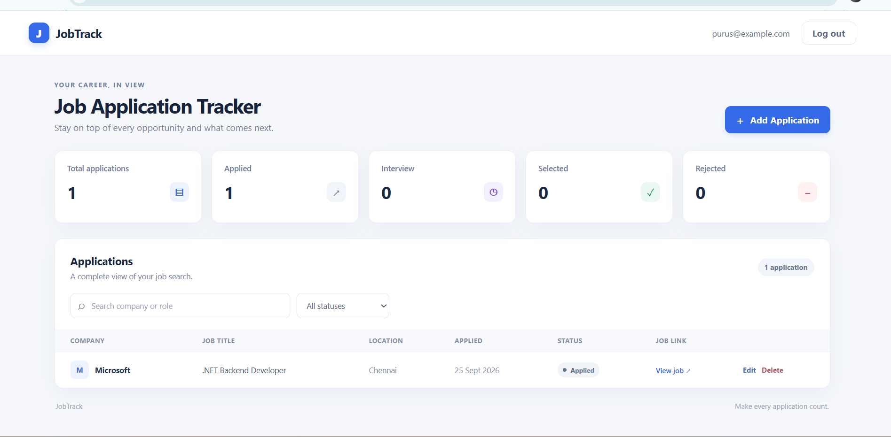
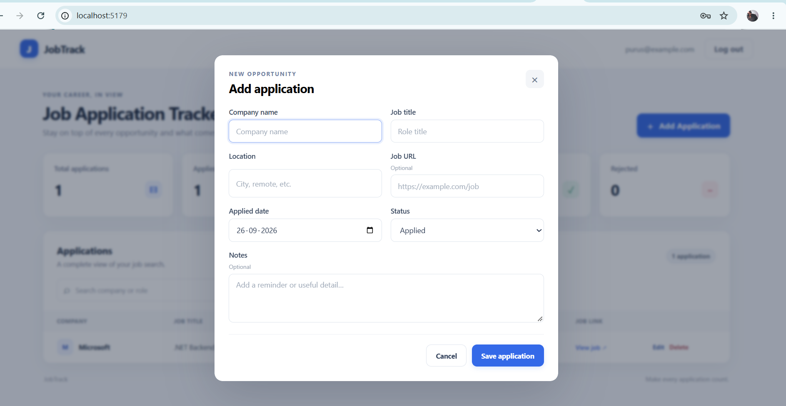

# JobTrack

**JobTrack is a full-stack job application tracking system built with ASP.NET Core Web API and a responsive vanilla JavaScript frontend.** It helps job seekers organize applications, follow hiring progress, and see an overview of their search in one place.

## Live Demo

### [Open the JobTrack live application →](https://prushjobtrack.onrender.com)

[](https://prushjobtrack.onrender.com) · [GitHub repository](https://github.com/Purusothamman0413/JobTrack)

> The Render free service may take a short time to wake up after inactivity.

## Screenshots

### Login


### Dashboard



### Add Application



## About the Project

JobTrack provides a focused workspace for managing a job search. Users can register and sign in, keep application details and notes together, update each application as it progresses, and use search, status filtering, and dashboard statistics to stay organized.

The project demonstrates REST API design, JWT authentication, relational data modeling with Entity Framework Core, SQLite persistence, and frontend integration. The Dockerized application is deployed to Render.

## Features

- User registration and login
- JWT-based authentication and user-specific application access
- Create, read, update, and delete job applications (CRUD)
- Search by company name or job title
- Filter applications by status
- Dashboard statistics for total applications and each status
- Interview and selection rates, applications added this month, status distribution, and recent applications
- Store location, applied date, job URL, notes, job type, work mode, salary, source, and priority
- Sort by newest, oldest, company, or priority
- Responsive web interface
- Swagger / OpenAPI API documentation
- Docker deployment on Render
- Automatically applies existing Entity Framework Core migrations at application startup

## Tech Stack

| Area | Technologies |
| --- | --- |
| Backend | C#, .NET 10, ASP.NET Core Web API |
| Data | Entity Framework Core, SQLite |
| Authentication | JWT Bearer authentication, ASP.NET Core PasswordHasher |
| Frontend | HTML5, CSS3, vanilla JavaScript |
| API documentation | Swagger / OpenAPI |
| Deployment | Docker, Render |

## Architecture

```text
┌───────────────────────────────┐
│           Browser             │
│       HTML / CSS / JavaScript │
└───────────────┬───────────────┘
                │ HTTP / JSON
                ▼
┌───────────────────────────────┐
│      ASP.NET Core Web API     │
│  Authentication · REST · CRUD │
└───────────────┬───────────────┘
                │ Entity Framework Core
                ▼
┌───────────────────────────────┐
│             SQLite            │
└───────────────────────────────┘

            Docker · Render
```

The browser loads the frontend from the ASP.NET Core application. The JavaScript client calls REST endpoints, and Entity Framework Core reads and writes application data in SQLite.

## Authentication

Registration creates a user account and stores a password hash. On successful login, the API returns a JWT. The frontend sends the token as a Bearer token with protected application requests. API queries restrict application data to the authenticated user.

For production deployment, provide the JWT signing key through environment configuration. The development placeholder is not a production secret.

## Application Statuses

Applications can be tracked with one of four statuses:

- **Applied** — application submitted
- **Interview** — interview process underway
- **Selected** — selected for the role
- **Rejected** — not moving forward

## API Endpoints

### Authentication

| Method | Endpoint | Description |
| --- | --- | --- |
| `POST` | `/api/auth/register` | Register an account |
| `POST` | `/api/auth/login` | Log in and receive a JWT |

### Applications

All application endpoints require a JWT Bearer token.

| Method | Endpoint | Description |
| --- | --- | --- |
| `GET` | `/api/applications` | List applications; supports optional `search` and `status` filters |
| `GET` | `/api/applications/{id}` | Get one application |
| `POST` | `/api/applications` | Create an application |
| `PUT` | `/api/applications/{id}` | Update an application |
| `DELETE` | `/api/applications/{id}` | Delete an application |
| `GET` | `/api/applications/stats` | Get totals, per-status counts, rates, and this-month count |

Application create/update requests accept `companyName`, `jobTitle`, `location`, `jobUrl`, `appliedDate`, `status`, `notes`, `jobType`, `workMode`, `salary`, `applicationSource`, and `priority`. The last five fields are optional. Salary is a non-negative amount with at most two decimal places. The API validates date, status, and enum values and scopes every application operation to the authenticated user.

The OpenAPI document and Swagger UI are available in Development at `/swagger/v1/swagger.json` and `/swagger`. Protected endpoints use the Bearer JWT security scheme.

## Run Locally

### Prerequisites

- .NET 10 SDK
- EF Core command-line tool (`dotnet-ef`) available for the project's installed EF Core version

From the project directory, run:

```powershell
dotnet restore
dotnet build
dotnet run
```

The application applies the existing EF Core migrations at startup. Open the URL printed by `dotnet run`; with the included HTTP development launch profile, the app is available at [http://localhost:5179/](http://localhost:5179/). Swagger UI is at [http://localhost:5179/swagger](http://localhost:5179/swagger). The default local database is SQLite (`jobtrack.db`); back it up before removing it.

## Deployment

JobTrack is packaged as a multi-stage Docker image using the .NET 10 SDK and ASP.NET Core runtime images, then deployed to Render. The container binds to Render's `PORT` environment variable and serves the frontend and API from the same application. At startup, the application applies the existing Entity Framework Core migrations to the configured SQLite database.

Set the JWT signing key as the `Jwt__Key` environment variable in Render. Keep production secrets in deployment configuration and out of source control. Render's filesystem is ephemeral by default, so SQLite changes can be lost when the service restarts or deploys. A persistent disk is a paid-service option; for production durability and concurrent use, use a managed PostgreSQL database. See [Render Persistent Disks](https://render.com/docs/disks) and [Render Free instances](https://render.com/docs/free).

The local development environment may log an ASP.NET Core Data Protection key-ring warning when the current Windows profile cannot be accessed. The API currently authenticates with manually signed, stateless JWTs and does not rely on Data Protection cookies, so this warning does not prevent JWT authentication. If cookie authentication or other protected payloads are added later, configure a durable, access-controlled key store for production.

## Future Improvements

- More detailed analytics and trends
- Kanban-style application pipeline
- Follow-up reminders and notifications
- Resume and document management
- PostgreSQL support
- Additional cloud deployment options

## Author

**Purusothamman** · [GitHub profile](https://github.com/Purusothamman0413)
